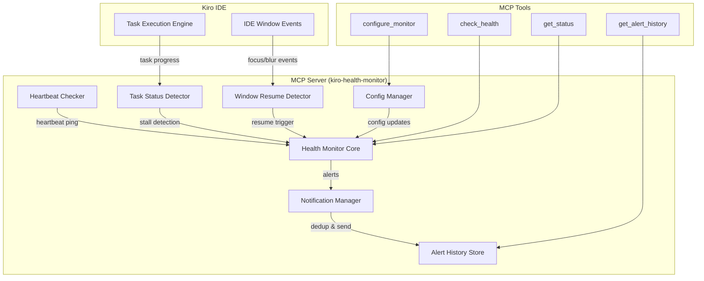
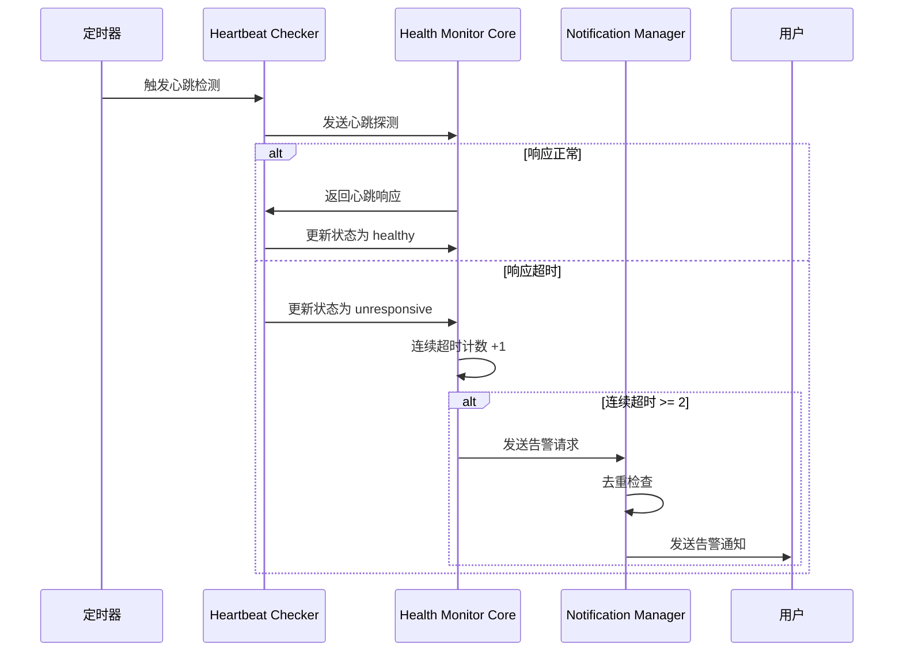

# 技术设计文档：Kiro Health Monitor

## 概述

Kiro Health Monitor 是一个 Kiro Power，以 MCP Server 为后端，提供对 Kiro IDE 健康状态的主动监控能力。核心功能包括：后台服务心跳检测、任务卡顿检测、IDE 窗口恢复检测、健康报告生成、告警通知管理以及可配置的无响应自动重试。用户只需安装 Python，即可通过 `uvx` 直接运行本 Power，无需额外安装依赖。

系统采用事件驱动 + 定时轮询的混合架构。心跳检测通过定时器周期性执行；任务卡顿检测通过监控任务进度时间戳实现；窗口恢复检测通过监听 IDE 窗口焦点事件触发。所有检测结果汇总到 Health Monitor 核心模块，由 Notification Manager 统一管理告警输出。

### 设计决策

1. **单进程架构**：所有检测逻辑运行在 MCP Server 进程内，通过 `asyncio` 任务调度和事件监听实现并发，避免多进程通信的复杂性。
2. **内存存储**：健康状态、告警历史等数据存储在内存中，MCP Server 重启后重置。这符合监控工具的临时性特征，无需持久化。
3. **Python 实现**：使用 Python + fastmcp 实现 MCP Server，用户只需安装 Python 即可通过 `uvx` 直接运行，无需额外安装依赖。
4. **去重窗口机制**：告警去重使用滑动时间窗口（5 分钟），避免同类告警频繁打扰用户。
5. **Auto_Retry 默认关闭**：自动重试是高风险操作，默认关闭，需用户显式开启。

## 架构

### 系统架构图



### 模块交互流程



## 组件与接口

### 1. HealthMonitorCore

核心协调模块，汇总所有检测结果并管理整体健康状态。

```python
from typing import Protocol

class IHealthMonitorCore(Protocol):
    """核心协调模块接口"""

    def get_health_status(self) -> HealthStatus:
        """获取当前健康状态"""
        ...

    def perform_health_check(self) -> HealthReport:
        """执行一次完整健康检查，返回健康报告"""
        ...

    def perform_deep_health_check(self) -> HealthReport:
        """执行深度健康检查（窗口离开超过10分钟时）"""
        ...

    def update_status(self, source: CheckSource, result: CheckResult) -> None:
        """更新健康状态"""
        ...

    async def start(self) -> None:
        """启动监控"""
        ...

    async def stop(self) -> None:
        """停止监控"""
        ...
```

### 2. HeartbeatChecker

定期向 MCP Server 发送心跳探测，检测后台服务存活状态。

```python
class IHeartbeatChecker(Protocol):
    """心跳检测器接口"""

    async def start(self, interval: int) -> None:
        """启动心跳检测定时器"""
        ...

    async def stop(self) -> None:
        """停止心跳检测"""
        ...

    async def ping(self) -> HeartbeatResult:
        """执行一次心跳检测"""
        ...

    def get_consecutive_timeouts(self) -> int:
        """获取连续超时次数"""
        ...

    def reset_timeout_count(self) -> None:
        """重置连续超时计数"""
        ...
```

### 3. TaskStatusDetector

监控任务执行状态，检测卡顿。

```python
class ITaskStatusDetector(Protocol):
    """任务状态检测器接口"""

    def track_task(self, task: TrackedTask) -> None:
        """注册一个正在执行的任务进行监控"""
        ...

    def untrack_task(self, task_id: str) -> None:
        """移除任务监控"""
        ...

    def update_task_progress(self, task_id: str, timestamp: float) -> None:
        """更新任务进度时间戳"""
        ...

    def check_for_stalls(self) -> list[StallCheckResult]:
        """检查所有被跟踪任务的卡顿状态"""
        ...

    def is_task_active(self, task_id: str) -> bool:
        """判断任务是否仍有活动（日志输出或资源变化）"""
        ...
```

### 4. WindowResumeDetector

监听 IDE 窗口焦点事件，在窗口恢复时触发健康检查。

```python
from typing import Callable, Optional

class IWindowResumeDetector(Protocol):
    """窗口恢复检测器接口"""

    def start_listening(self) -> None:
        """开始监听窗口事件"""
        ...

    def stop_listening(self) -> None:
        """停止监听"""
        ...

    def record_background_timestamp(self) -> None:
        """记录窗口进入后台的时间"""
        ...

    def get_background_duration(self) -> Optional[float]:
        """获取窗口离开时长（毫秒）"""
        ...

    def on_resume(self, callback: Callable[[float], None]) -> None:
        """注册窗口恢复回调"""
        ...
```

### 5. NotificationManager

管理告警通知的发送、去重和历史记录。

```python
class INotificationManager(Protocol):
    """通知管理器接口"""

    def send_alert(self, alert: Alert) -> bool:
        """发送告警通知（内部执行去重）"""
        ...

    def send_recovery_notification(self, message: str) -> None:
        """发送恢复通知"""
        ...

    def get_alert_history(self, filter: Optional[AlertFilter] = None) -> list[AlertRecord]:
        """查询历史告警记录"""
        ...

    def is_duplicate(self, alert_type: str) -> bool:
        """检查告警是否在去重窗口内"""
        ...
```

### 6. ConfigManager

管理监控参数配置。

```python
from typing import Any

class IConfigManager(Protocol):
    """配置管理器接口"""

    def get_config(self) -> MonitorConfig:
        """获取当前配置"""
        ...

    def update_config(self, partial: dict[str, Any]) -> ConfigUpdateResult:
        """更新配置（含参数校验）"""
        ...

    def validate_param(self, key: str, value: Any) -> ValidationResult:
        """校验参数值是否在合理范围内"""
        ...
```

### 7. MCP 工具接口

```python
from dataclasses import dataclass
from typing import Optional, Literal

# check_health: 执行即时健康检查
# 输入: 无参数
@dataclass
class CheckHealthOutput:
    report: HealthReport

# get_status: 获取当前状态摘要
# 输入: 无参数
@dataclass
class GetStatusOutput:
    status: HealthStatus
    last_heartbeat: str          # ISO 时间戳
    last_heartbeat_latency: float  # 毫秒
    active_task_count: int
    stalled_task_count: int

# configure_monitor: 动态调整配置
@dataclass
class ConfigureMonitorInput:
    heartbeat_interval: Optional[int] = None    # 秒，范围 [10, 300]
    response_timeout: Optional[int] = None      # 秒，范围 [1, 30]
    stall_threshold: Optional[int] = None       # 秒，范围 [10, 600]
    auto_retry: Optional[Literal['on', 'off']] = None

@dataclass
class ConfigureMonitorOutput:
    success: bool
    config: MonitorConfig
    errors: Optional[list[str]] = None

# get_alert_history: 查询历史告警
@dataclass
class GetAlertHistoryInput:
    start_time: Optional[str] = None   # ISO 时间戳
    end_time: Optional[str] = None     # ISO 时间戳
    alert_type: Optional[AlertType] = None

@dataclass
class GetAlertHistoryOutput:
    alerts: list[AlertRecord]
    total: int
```

## 数据模型

```python
from __future__ import annotations
from dataclasses import dataclass, field
from enum import Enum
from typing import Optional, Literal

class HealthStatus(str, Enum):
    """健康状态枚举"""
    HEALTHY = 'healthy'
    DEGRADED = 'degraded'
    UNRESPONSIVE = 'unresponsive'

class CheckSource(str, Enum):
    """检测来源"""
    HEARTBEAT = 'heartbeat'
    TASK_DETECTOR = 'task_detector'
    WINDOW_RESUME = 'window_resume'

class AlertType(str, Enum):
    """告警类型"""
    HEARTBEAT_TIMEOUT = 'heartbeat_timeout'
    TASK_STALL = 'task_stall'
    SERVICE_UNRESPONSIVE = 'service_unresponsive'
    TASK_RECOVERED = 'task_recovered'
    SERVICE_RECOVERED = 'service_recovered'
    AUTO_RETRY_TRIGGERED = 'auto_retry_triggered'
    AUTO_RETRY_FAILED = 'auto_retry_failed'
    AUTO_RETRY_LIMIT_REACHED = 'auto_retry_limit_reached'

class AlertLevel(str, Enum):
    """告警级别"""
    INFO = 'info'
    WARNING = 'warning'
    CRITICAL = 'critical'

@dataclass
class HeartbeatResult:
    """心跳检测结果"""
    success: bool
    latency: float          # 毫秒
    timestamp: float         # Unix 时间戳
    error: Optional[str] = None  # 异常信息

@dataclass
class TrackedTask:
    """被跟踪的任务"""
    task_id: str
    name: str
    start_time: float
    last_progress_update: float
    last_log_output: Optional[float] = None
    retry_count: int = 0
    auto_retry_disabled: bool = False

@dataclass
class StallCheckResult:
    """卡顿检查结果"""
    task_id: str
    is_stalled: bool
    stall_duration: float    # 毫秒
    is_active: bool          # 是否仍有日志/资源活动

@dataclass
class Alert:
    """告警记录"""
    type: AlertType
    level: AlertLevel
    message: str
    description: str
    suggested_action: str
    related_task_id: Optional[str] = None

@dataclass
class AlertRecord(Alert):
    """带 ID 和时间戳的告警记录"""
    id: str = ''
    timestamp: float = 0.0

@dataclass
class AlertFilter:
    """告警筛选条件"""
    start_time: Optional[float] = None
    end_time: Optional[float] = None
    alert_type: Optional[AlertType] = None

@dataclass
class HeartbeatInfo:
    last_check_time: float
    last_latency: float
    consecutive_timeouts: int

@dataclass
class TaskInfo:
    active_count: int
    stalled_tasks: list[StallCheckResult]

@dataclass
class WindowInfo:
    is_active: bool
    active_duration: float
    last_background_time: Optional[float] = None

@dataclass
class AlertSummary:
    recent_alerts: list[AlertRecord]
    total_alerts: int

@dataclass
class HealthReport:
    """健康报告"""
    status: HealthStatus
    timestamp: float
    heartbeat: HeartbeatInfo
    tasks: TaskInfo
    window: WindowInfo
    alert_summary: AlertSummary
    recommendations: list[str] = field(default_factory=list)

@dataclass
class MonitorConfig:
    """监控配置"""
    heartbeat_interval: int = 30    # 秒，默认 30
    response_timeout: int = 5       # 秒，默认 5
    stall_threshold: int = 60       # 秒，默认 60
    auto_retry: Literal['on', 'off'] = 'off'  # 默认 'off'

@dataclass
class ConfigUpdateResult:
    """配置更新结果"""
    success: bool
    config: MonitorConfig
    errors: Optional[list[str]] = None

@dataclass
class ValidationResult:
    """参数校验结果"""
    valid: bool
    message: Optional[str] = None
    range: Optional[dict[str, int]] = None  # {"min": ..., "max": ...}

# 参数有效范围定义
CONFIG_RANGES: dict[str, dict[str, int]] = {
    'heartbeat_interval': {'min': 10, 'max': 300},
    'response_timeout': {'min': 1, 'max': 30},
    'stall_threshold': {'min': 10, 'max': 600},
}
```

## 正确性属性（Correctness Properties）

*属性（Property）是指在系统所有合法执行中都应保持为真的特征或行为——本质上是对系统应做什么的形式化陈述。属性是人类可读规格说明与机器可验证正确性保证之间的桥梁。*

### Property 1: 心跳状态判定

*For any* 心跳检测结果，若响应延迟 < Response_Timeout 则 Health_Status 应为 healthy；若响应延迟 >= Response_Timeout（超时）则应为 unresponsive；若发生网络异常则应为 degraded。

**Validates: Requirements 1.2, 1.3, 1.5**

### Property 2: 连续超时告警阈值

*For any* 心跳检测结果序列，Notification_Manager 发送告警当且仅当序列中最近连续超时次数 >= 2。

**Validates: Requirements 1.4**

### Property 3: 任务卡顿检测（含活动判断）

*For any* 被跟踪的任务，该任务被标记为卡顿当且仅当 (当前时间 - 最后进度更新时间) > Stall_Threshold 且该任务没有产生日志输出或资源消耗变化。

**Validates: Requirements 2.2, 2.4**

### Property 4: 卡顿恢复往返

*For any* 处于卡顿状态的任务，当收到新的进度更新后，该任务的卡顿标记应被自动撤销。

**Validates: Requirements 2.5**

### Property 5: 深度检查阈值判定

*For any* 窗口恢复事件，执行深度健康检查当且仅当窗口离开时长 > 10 分钟（600000 毫秒）。

**Validates: Requirements 3.5**

### Property 6: 健康报告完整性与 JSON 往返

*For any* 系统状态，生成的 Health_Report 序列化为 JSON 后再反序列化应得到等价对象，且报告必须包含所有必需字段：status、heartbeat、tasks、window、alertSummary。

**Validates: Requirements 4.2, 4.3**

### Property 7: 异常指标建议

*For any* 包含至少一个异常指标的 Health_Report，recommendations 数组应非空，且每个异常指标都应有对应的建议修复操作。

**Validates: Requirements 4.4**

### Property 8: 配置参数范围校验

*For any* 配置参数值，若该值超出定义的有效范围（heartbeatInterval: [10, 300]，responseTimeout: [1, 30]，stallThreshold: [10, 600]），则 updateConfig 应返回 success=false 并包含有效范围说明。

**Validates: Requirements 5.4**

### Property 9: 告警去重窗口

*For any* 同一类型的两条告警，若两条告警的时间间隔 < 5 分钟，则第二条应被抑制（sendAlert 返回 false）；若间隔 >= 5 分钟，则第二条应正常发送。

**Validates: Requirements 6.1**

### Property 10: 告警内容完整性

*For any* 告警通知，其内容必须包含：问题描述（description）、检测时间（timestamp）、建议操作步骤（suggestedAction）。

**Validates: Requirements 6.2**

### Property 11: 健康状态到告警级别映射

*For any* Health_Status 值，告警级别映射应满足：healthy → info，degraded → warning，unresponsive → critical。

**Validates: Requirements 6.3**

### Property 12: 状态恢复通知

*For any* 状态转换对 (previousStatus, newStatus)，恢复通知被发送当且仅当 previousStatus 为 unresponsive 且 newStatus 为 healthy。

**Validates: Requirements 6.4**

### Property 13: 自动重试行为

*For any* Health_Status 为 unresponsive 且存在活跃任务的场景，当 Auto_Retry 为 on 时应自动取消并重新执行任务且发送 info 级别通知；当 Auto_Retry 为 off 时应仅发送告警通知而不执行任何自动操作。

**Validates: Requirements 7.3, 7.4, 7.5**

### Property 14: 自动重试次数限制

*For any* 被跟踪的任务，自动重试被允许当且仅当该任务的 retryCount < 3。当 retryCount 达到 3 时，该任务的 autoRetryDisabled 应被设置为 true。

**Validates: Requirements 7.6**

## 错误处理

### 心跳检测错误

| 错误场景 | 处理方式 |
|---------|---------|
| 心跳响应超时 | 递增连续超时计数，更新状态为 unresponsive |
| 网络异常（连接拒绝、DNS 失败等） | 记录异常详情，更新状态为 degraded |
| 心跳响应格式异常 | 记录警告日志，视为超时处理 |

### 任务检测错误

| 错误场景 | 处理方式 |
|---------|---------|
| 任务 ID 不存在 | 忽略并记录警告日志 |
| 任务状态查询失败 | 记录错误，保持上一次检测结果 |
| 自动重试执行异常 | 记录异常信息，发送告警通知用户手动介入（需求 7.7） |

### 配置错误

| 错误场景 | 处理方式 |
|---------|---------|
| 参数值超出范围 | 拒绝更新，返回有效范围说明 |
| 参数类型错误 | 拒绝更新，返回期望类型说明 |
| 未知参数名 | 忽略未知参数，仅处理已知参数 |

### 通知错误

| 错误场景 | 处理方式 |
|---------|---------|
| 通知发送失败 | 记录错误日志，不阻塞主流程 |
| 告警历史存储溢出 | 采用 FIFO 策略，保留最近 1000 条记录 |

## 测试策略

### 属性测试（Property-Based Testing）

使用 **hypothesis** 库（Python 生态中最成熟的 PBT 库）实现属性测试。

- 每个属性测试运行最少 **100 次迭代**（通过 `@settings(max_examples=100)` 配置）
- 每个测试用注释标注对应的设计属性
- 标注格式：`Feature: kiro-health-monitor, Property {number}: {property_text}`

#### 属性测试覆盖范围

| 属性编号 | 测试内容 | 生成器策略 |
|---------|---------|-----------|
| Property 1 | 心跳状态判定 | 使用 `st.floats()` 生成随机延迟值和超时阈值 |
| Property 2 | 连续超时告警 | 使用 `st.lists(st.booleans())` 生成随机心跳结果序列（成功/超时混合） |
| Property 3 | 任务卡顿检测 | 使用 `st.builds()` 生成随机任务状态（时间戳、日志活动） |
| Property 4 | 卡顿恢复 | 生成随机卡顿任务，应用进度更新 |
| Property 5 | 深度检查阈值 | 使用 `st.floats()` 生成随机窗口离开时长 |
| Property 6 | 报告 JSON 往返 | 使用 `st.builds()` 生成随机系统状态组合 |
| Property 7 | 异常建议 | 生成包含随机异常指标的报告 |
| Property 8 | 配置校验 | 使用 `st.integers()` 和 `st.floats()` 生成随机参数值（含越界值） |
| Property 9 | 告警去重 | 生成随机告警类型和时间间隔 |
| Property 10 | 告警内容 | 使用 `st.builds()` 生成随机 Alert 对象 |
| Property 11 | 状态级别映射 | 使用 `st.sampled_from()` 枚举所有 HealthStatus 值 |
| Property 12 | 恢复通知 | 生成随机状态转换对 |
| Property 13 | 自动重试行为 | 生成随机场景（config + status + tasks） |
| Property 14 | 重试次数限制 | 使用 `st.integers()` 生成随机 retryCount 值 |

### 单元测试

单元测试聚焦于具体示例、边界条件和集成点：

- **心跳定时器**：验证定时器按配置间隔触发（需求 1.1）
- **窗口恢复事件**：验证窗口恢复时触发健康检查（需求 3.1）
- **窗口恢复通知**：验证无响应时显示提示、正常时静默（需求 3.2, 3.3）
- **后台时间戳记录**：验证进入后台时记录时间戳（需求 3.4）
- **报告响应时间**：验证报告在超时时间内返回（需求 4.1）
- **MCP 工具注册**：验证四个工具均已注册（需求 5.1-5.3, 5.5）
- **Auto_Retry 配置**：验证接受 on/off 值（需求 7.1）
- **Auto_Retry 默认值**：验证默认为 off（需求 7.2）
- **重试异常处理**：验证异常时记录并通知（需求 7.7）
- **卡顿告警内容**：验证告警包含取消重试建议（需求 2.3）

### 测试工具

- **测试框架**：pytest
- **PBT 库**：hypothesis
- **Mock 工具**：unittest.mock（`MagicMock`、`AsyncMock`、`patch`）
- **异步测试**：pytest-asyncio
- **断言库**：pytest 内置 assert
